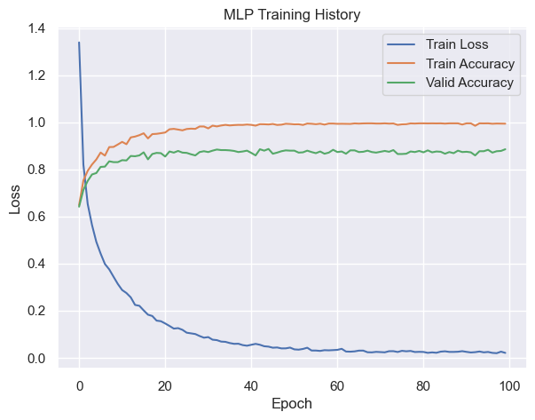
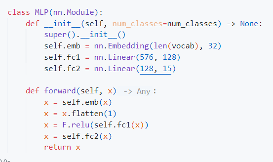
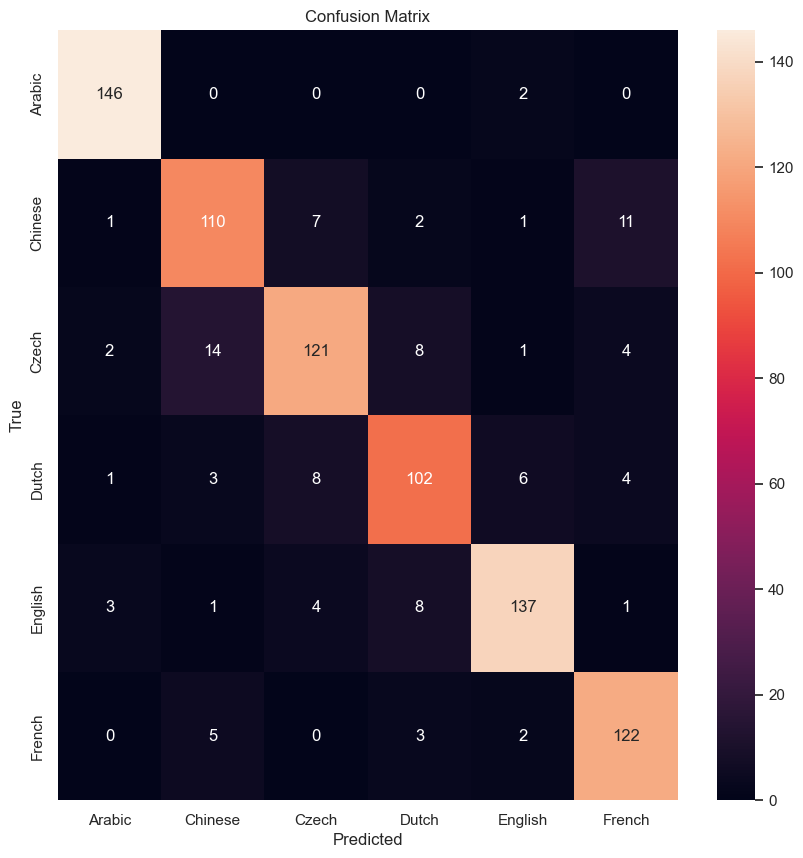
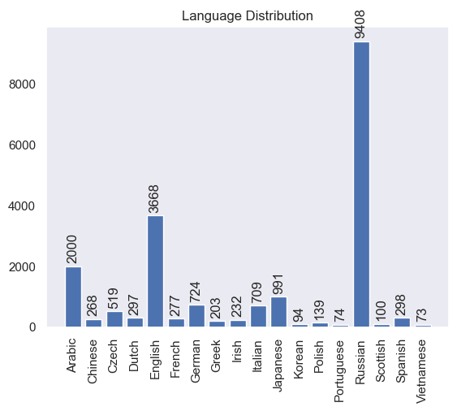
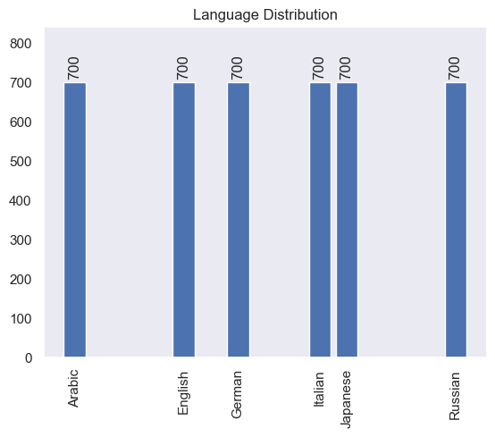

# Character Level Name Nationality Classification

Classify the nationality of a given name.
[Dataset Link](https://download.pytorch.org/tutorial/data.zip)


| Train Accuracy  | Test Accuracy |
|-----------------|---------------|
|   0.9943        |   0.8857      |

## Training History


## Model
### MLP


## Results
### Confusion Matrix


### Classification Report:


## Data Distribution
### original data

### after filtering the data:


## Example Predictions
```
Arena              | Italian | Italian 
Okita              | Japanese | Japanese 
Pesce              | Italian | Italian 
Button             | English | English 
Glöckner           | German | German 
Barlow             | English | English 
Ichisada           | Japanese | Japanese 
Hayakawa           | Japanese | Japanese 
Devaney            | English | English 
Ableukhov          | Russian | Russian 
Ghanem             | Arabic | Arabic 
Adkins             | English | Russian ❌
Segreti            | Italian | Italian 
Essa               | Arabic | Arabic 
Aloia              | Italian | Japanese ❌
Brelsford          | English | English 
Falkenrath         | German | German 
Adenauer           | German | Russian ❌
Ghannam            | Arabic | Arabic 
Aylward            | English | English 
Agaponov           | Russian | Russian 
Ferrara            | Italian | Italian 
Kaibara            | Japanese | Japanese 
Langer             | German | German 
Nagano             | Japanese | Japanese 
Locatelli          | Italian | Italian 
Rahal              | Arabic | Arabic 
Abramovsky         | Russian | Russian 
Kaufman            | German | German 
Poggio             | Italian | Italian 
Shalhoub           | Arabic | Arabic 
Ghanem             | Arabic | Arabic 
Walkenhorst        | German | German 
Von wegberg        | German | German 
Schuler            | German | German 
Assaf              | Arabic | Arabic 
Natsume            | Japanese | Japanese 
Kleid              | German | German 
Belluomi           | Italian | Italian 
Haddad             | Arabic | Arabic 
Dardenne           | English | German ❌
Dixon              | English | English 
Käufer             | German | German 
Boutros            | Arabic | Arabic 
Okanao             | Japanese | Japanese 
Abubakirov         | Russian | Russian 
Aquila             | Italian | Italian 
Tannous            | Arabic | Arabic 
Abdrakhmanov       | Russian | Russian 
Hirasi             | Japanese | Japanese 
Schroeter          | German | German 
Andreli            | Russian | Russian 
Maria              | Italian | Italian 
Van tonder         | German | German 
Agenosov           | Russian | Russian 
Onishi             | Japanese | Japanese 
Colley             | English | English 
Doi                | Japanese | Japanese 
Baldini            | Italian | Italian 
Asker              | Arabic | Arabic 
Amari              | Arabic | Arabic 
Fermi              | Italian | Italian 
Harb               | Arabic | Arabic 
Adadurov           | Russian | Russian 
Auttenberg         | German | German 
Brennan            | English | English 
Frost              | German | German 
Crisp              | English | English 
Basile             | Italian | English ❌
Atiyeh             | Arabic | Arabic 
Butcher            | English | German ❌
Amari              | Arabic | Arabic 
Alberici           | Italian | Italian 
Beattie            | English | Italian ❌
Abramovitch        | Russian | Russian 
Bishara            | Arabic | Arabic 
Asghar             | Arabic | Arabic 
Cornish            | English | English 
Onohara            | Japanese | Japanese 
Aboimov            | Russian | Russian 
Vescovi            | Italian | Italian 
Nervetti           | Italian | Italian 
Brune              | German | German 
Bachmeier          | German | German 
Admakin            | Russian | Russian 
Agar               | English | Russian ❌
Flater             | German | German 
Kalb               | Arabic | German ❌
Cham               | Arabic | Arabic 
Agulian            | Russian | Russian 
Altimari           | Italian | Italian 
Gerhard            | German | German 
Nader              | Arabic | Arabic 
Shadid             | Arabic | Arabic 
Futabatei          | Japanese | Japanese 
Aswad              | Arabic | Arabic 
Churchill          | English | English 
Koury              | Arabic | Arabic 
Leggièri           | Italian | Italian 
Buxton             | English | English 
Biermann           | German | German 
Antyuganov         | Russian | Russian 
Arthur             | English | English 
Enoki              | Japanese | Japanese 
Veronesi           | Italian | Italian 
Kaspar             | German | Arabic ❌
Abdulazizov        | Russian | Russian 
Nishimura          | Japanese | Japanese 
Blackmore          | English | English 
Scordato           | Italian | Italian 
Graner             | German | German 
Alunni             | Italian | Russian ❌
Atvilov            | Russian | Russian 
Barr               | English | English 
Raneri             | Italian | Italian 
Roth               | German | German 
Pavesi             | Italian | Italian 
Bishara            | Arabic | Arabic 
Beatty             | English | English 
Arrowsmith         | English | Russian ❌
Teufel             | German | German 
Quraishi           | Arabic | Arabic 
Dalton             | English | English 
Weiman             | German | German 
Ashby              | English | English 
Nakadai            | Japanese | Japanese 
Kudo               | Japanese | Japanese 
Kasaya             | Japanese | Japanese 
Abramchikoff       | Russian | Russian 
Hakimi             | Arabic | Japanese ❌
Masih              | Arabic | Arabic 
Alam               | English | English 
Andrushkevich      | Russian | Russian 
Guerra             | Italian | German ❌
Shammas            | Arabic | Arabic 
Bevan              | English | English 
Adibekov           | Russian | Russian 
Hildebrand         | German | German ```
