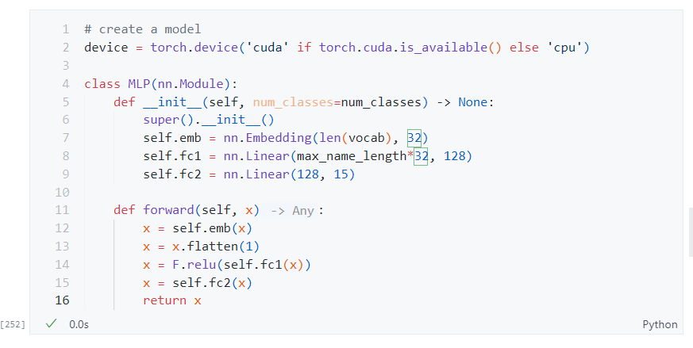
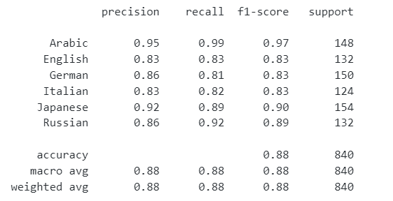

# Character Level Name Nationality Classification

Classify the nationality of a given name.

[Dataset Link](https://download.pytorch.org/tutorial/data.zip)

| Train Accuracy  | Test Accuracy |
|-----------------|---------------|
|   0.9943        |   0.8857      |
|

## Training History

## Model
MLP:

## Results
Confusion Matrix:

Classification Report:

## Data Distribution

after filtering the data:

